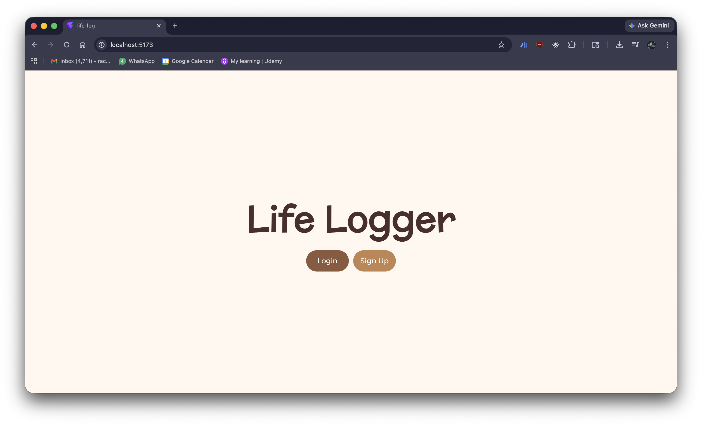

# Life Logger
Aims to create a simple task and event tracker, getting rid of unnecessary clutter for those who just want to keep track of their events without filling out a bunch of extra fields.

## How to use?
### Pre-requisites
- Node.js
- Node package manager
- PostgreSQL
- pgAdmin
### Configuration and Running?
- Clone the repo.
- Open two terminal / command prompts in the directory.
- `cd` into the `client` from one terminal and `server` from the other.
- Run `npm i` in both the folders.
- On pgAdmin, create a new database with any name.
- Create two tables in the database, `users` and `logs` using the commands mentioned in the `Commands.sql` file in the backend folder. 
- Create a `.env` file in the server folder and put the following info according to your Postgres configuration.
- Choose any session secret.
```env
PG_USER=""
PG_HOST="localhost"
PG_DATABASE=""
PG_PASSWORD=""
PG_PORT=
SESSION_SECRET=""
```
- In the server folder, execute the command `node index.js`.
- In the client folder, execute the command `npm run dev`.
